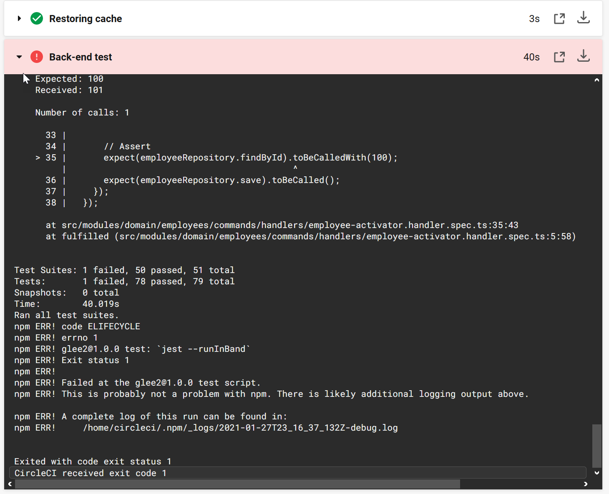
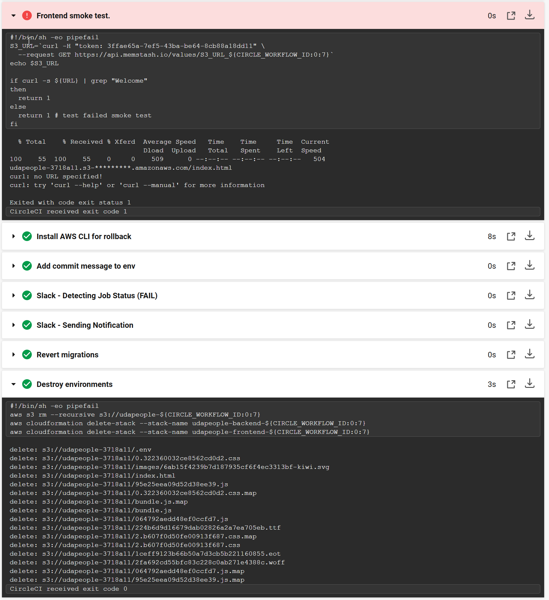
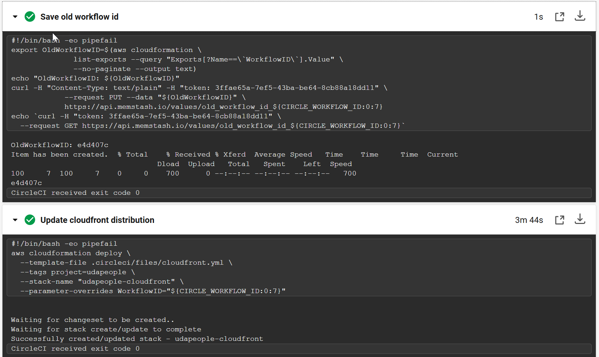
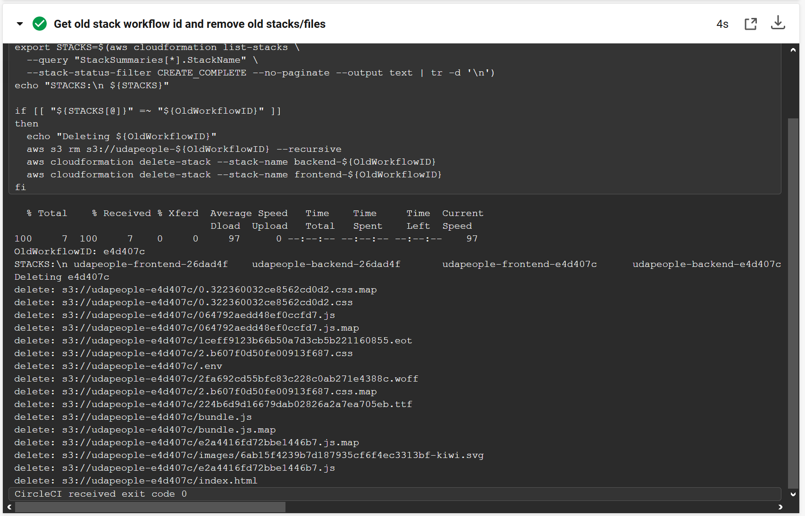

# Project 3: Give your application auto-deploy superpowers
## Deliverables
### 1. Selling CI/CD to team or organization 
[presentation](presentation.pdf)
### 2. URLs
- [Public URL to GitHub repository][URL01]
- [Public URL to S3 Bucket][URL02]
- [Public URL to CloudFront distribution][URL03]
- [Public URL to backend application in EC2][URL04]
- [Public URL to Prometheus Server][URL05]
## 3. Screenshots
1. Job failed because of compile errors

2.  Job failed because of unit tests

3. Job failed because of vulnerable packages

4. Alert from failed build and corresponding fix to Slack

5. Appropriate job failure for infrastructure creation

6. Appropriate job failure for smoke test

7. Successful rollback from failed smoke test

8. Successful job promotion

9. Successful job cleanup

10. Deployments only on production branch

11. EC2 instance graph (memory, disk spae, CPU usage)

12. Prometheus alert

[URL01]: https://github.com/StuKozola/Udacity-CloudDevOps-UdaPeople/
[URL02]: http://udapeople-13d3383.s3-us-west-2.amazonaws.com/index.html
[URL03]: http://dqxffzkcibkgw.cloudfront.net
[URL04]: http://ec2-34-216-180-234.us-west-2.compute.amazonaws.com:3030/api/status
[URL05]: http://ec2-34-217-47-143.us-west-2.compute.amazonaws.com:9090/